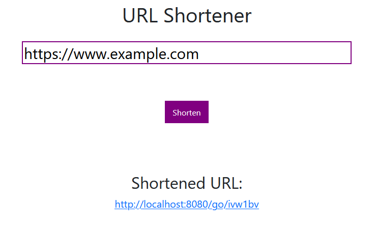

# urlshortener

## Description

A basic web app to create, store and serve shortened URLs.

Written in Go using the [Go Fiber Framework](https://gofiber.io/), and using an SQLite database.

Data is stored in `./data/linkdata.db` and `./data/linkdata_test.db`, the latter is identically set up, and used for testing.

## Building and running

Built binaries are in /bin for Windows - defaults to the current local IP on port 8080

Command line options are available with `-help`

Makefile also contains useful shortcuts for various tasks like running against test/prod databases, and running tests with or without coverage output.

## Usage

Navigate to the URL where the app is running, and enter the URL you want to be shortened. Simple!

